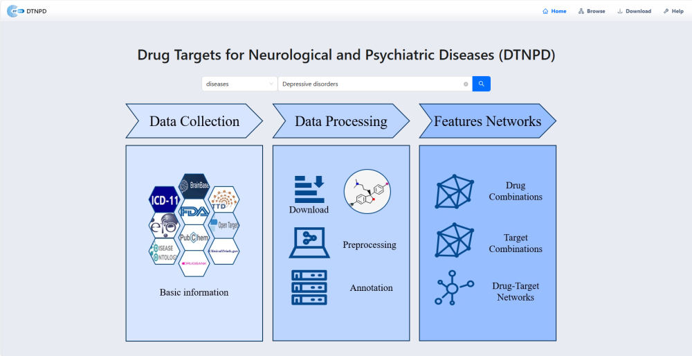
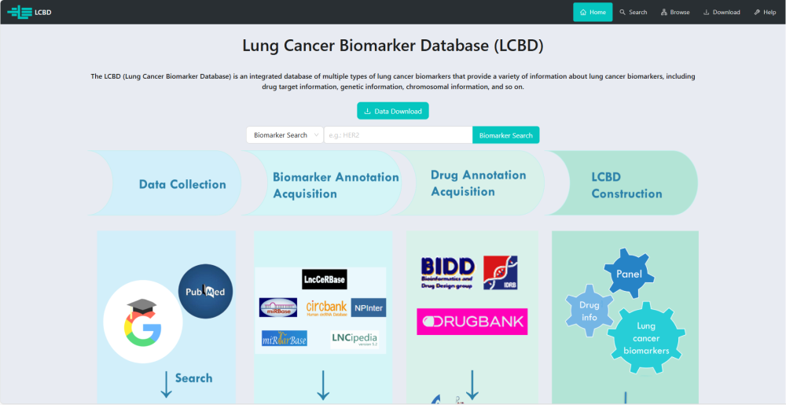



<!-- 
================================================================================
// Page-specific styles for resource cards
// This version is robust against Markdown parser issues.
================================================================================
-->

<!-- 
================================================================================
// Card Layout Starts Here
================================================================================
-->

  <!-- Card 1: GitHub -->
  

    
    

      
    

    

      <h3>课题组GitHub主站</h3>
      
这里存放了课题组所有开源项目的源代码、文档及相关介绍。

    

  

  <!-- Card 2: DTNPD -->
  

    
    

      
    

    

      <h3>DTNPD: 神经与精神疾病药物靶点数据库</h3>
      
一个包含神经与精神疾病药物和靶点的综合数据库，构建了“药物-靶点”网络和药物组合网络。

      

        <a href="https://scholar.google.com/scholar?q=DTNPD%3A%20A%20comprehensive%20database%20of%20drugs%20and%20targets%20for%20neurological%20and%20psychiatric%20disorders" target="_blank" rel="noopener noreferrer">相关出版物 &rarr;</a>
      

    

  

  <!-- Card 3: LCBD -->
  

    
    

      
    

    

      <h3>LCBD: 肺癌生物标志物数据库</h3>
      
一个包含多种肺癌生物标志物的综合数据库，提供药物靶点、遗传及染色体信息等。

      

        <a href="https://scholar.google.com/scholar?q=Lung%20Cancer%20Biomarker%20Database%20(LCBD)%3A%20A%20Comprehensive%20and%20Curated%20Repository%20of%20Lung%20Cancer%20Biomarkers" target="_blank" rel="noopener noreferrer">相关出版物 &rarr;</a>
      

    

  

  <!-- Card 4: HN-DREP -->
  

    
    

      
    

    

      <h3>HN-DREP: 异构网络药物重定位评估数据库</h3>
      
一个评估基于网络的异构药物重定位方法并预测药物与疾病关联的平台。

      

        <a href="https://scholar.google.com/scholar?q=A%20Comparative%20Benchmarking%20and%20Evaluation%20Framework%20for%20Heterogeneous%20Network-Based%20Drug%20Repositioning%20Methods" target="_blank" rel="noopener noreferrer">相关出版物 &rarr;</a>
      

    

  

